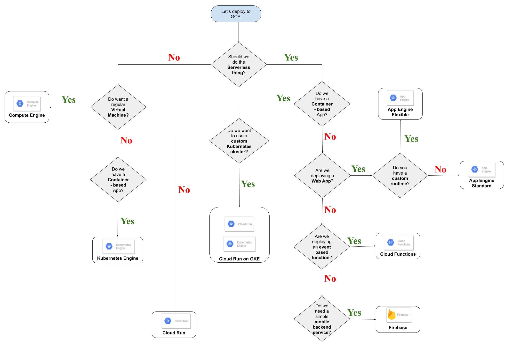

# Google Cloud Code Deployment Roadmap
> This repo is based on experiences from contributors and helps Google Cloud users answer the question.  
**Where should I Deploy my Code on Google Cloud Platform**

-----

## Resources to help you make better decisions.

### Containers
- [Choosing an option to run Containers](https://cloud.google.com/container-options/)

### Serverless
- [Choosing a Serverless option](https://cloud.google.com/serverless-options/)

### Google Compute Engine
- [Choosing a VM Instance Machine Type](https://cloud.google.com/compute/docs/machine-types)

### Google App Engine
- [Choosing an App Engine environment](https://cloud.google.com/appengine/docs/the-appengine-environments)

### Google Kubernetes Engine
- [Quickstart: Deploying a language-specific app](https://cloud.google.com/kubernetes-engine/docs/quickstarts/deploying-a-language-specific-app)

### Google Cloud Run
- [Choose the platform that fits you](https://cloud.google.com/run/#choose-the-platform-that-fits-you)

### Firebase
- [What can I do with Firebase Hosting?](https://firebase.google.com/docs/hosting/use-cases)

-----

This is not an official Google project or roadmap. Refer to the [Cloud Run documentation][docs] for the authoritative information. 

> **Do you still have doubts of where to Deploy?** Check out [**Google Cloud Hosting Options Analysis**](https://cloud.google.com/hosting-options/#hosting-options)
